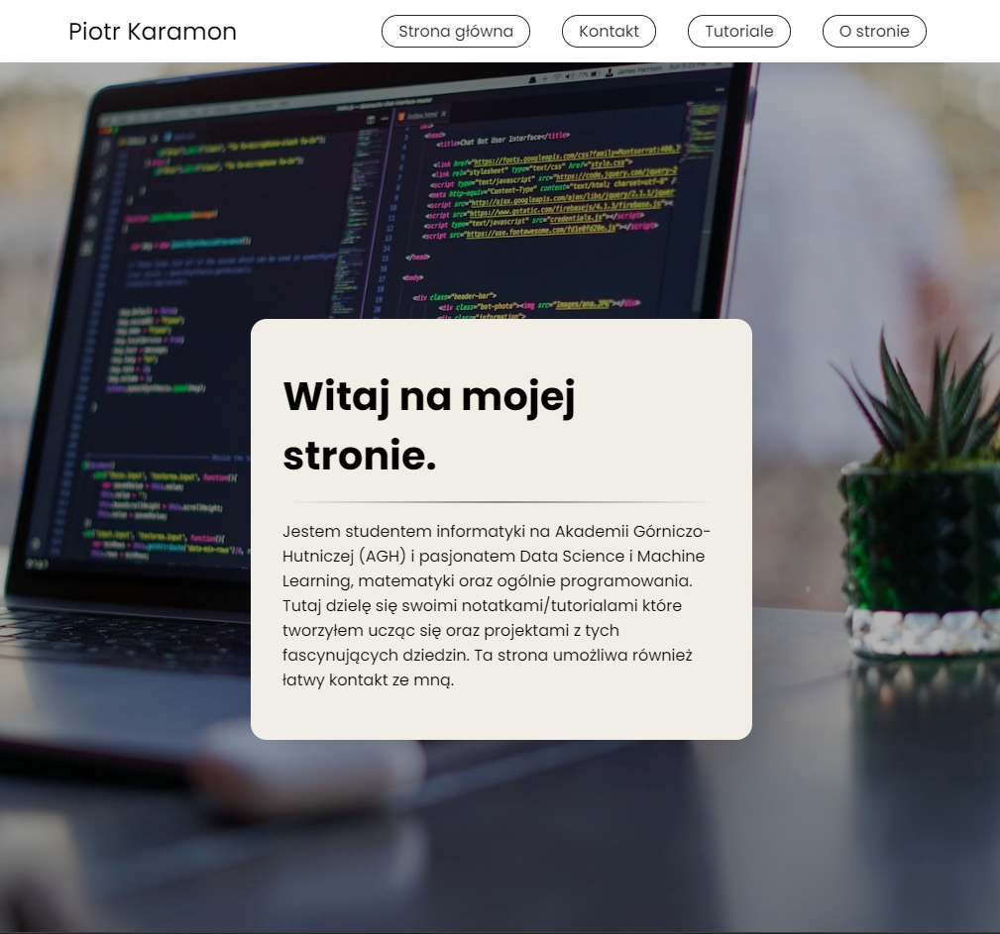
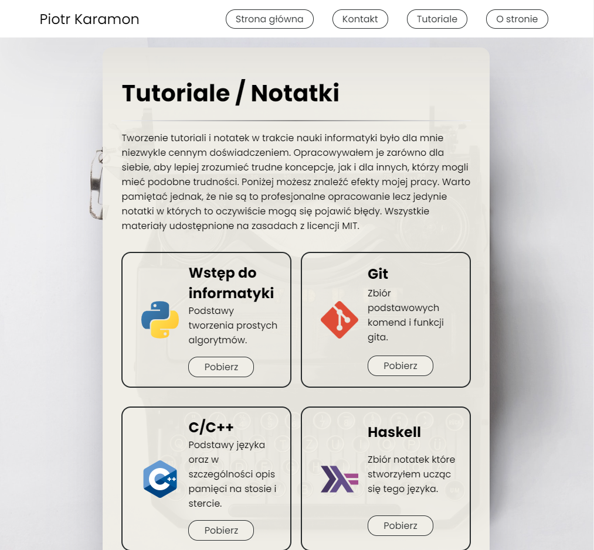

# Introduction to Web Applications - Micro Project 🌐✨

This repository contains the micro project for the Introduction to Web Applications course at AGH UST.
I created a personal website to showcase my interests and also to share my notes for various technologies.

## Highlights 📸

## Features 🌟

- **Responsive Design**
- **Contact Form**
- **About me section**
- **Page with my own notes/tutorials** 

## Built With 🛠

- **HTML5** - For structuring the content.
- **CSS3** - For styling and layout enhancements.
- **JavaScript** - To add validate contact form.

## Getting Started 🚀

1. Clone the repo
2. Open `src/index.html` in your browser or use a live server extension in your code editor.
